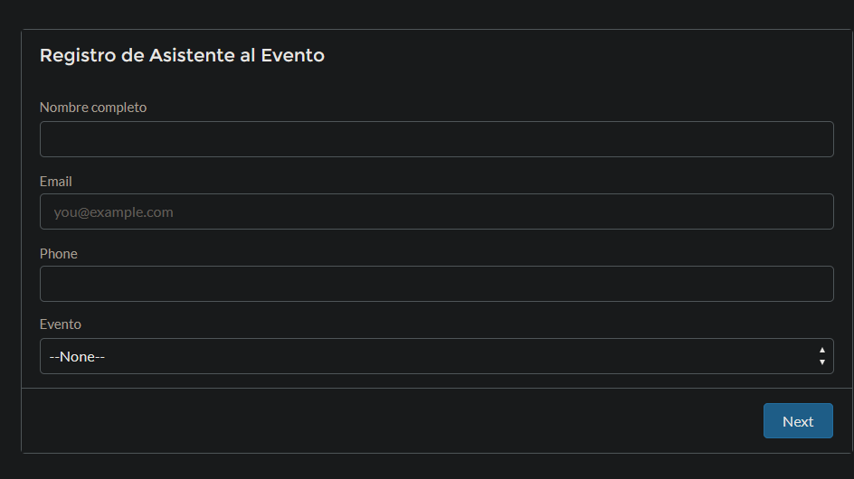
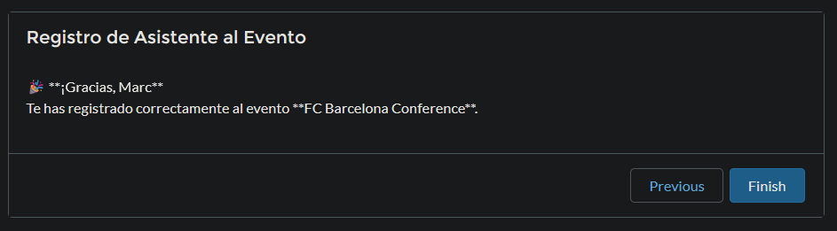

# Salesforce Event Registration App

A public-facing event registration app built on the Salesforce Platform. Users can register for events through a web-based flow, with built-in Apex validation to prevent duplicate signups.


## 🚀 Features

- Public-facing registration form via Experience Cloud
- Salesforce Screen Flow to collect:
  - Full Name
  - Email
  - Phone (optional)
  - Event selection (from live event records)
- Apex Trigger to prevent duplicate attendee registration per event
- Confirmation message upon successful registration
- Developer-friendly structure using Salesforce DX (SFDX)

## 🎯 Use Case

Designed for managing event sign-ups in corporate or educational environments. Prevents multiple registrations by the same user (based on email) for a single event.

## 🛠️ Technologies Used

- Salesforce Platform
- Apex
- SOQL
- Screen Flow
- Experience Cloud
- Salesforce DX (SFDX)
- Git + GitHub

## 📸 Screenshots

| Flow Form | Confirmation Message |
|-----------|----------------------|
|  |  |

## 🧪 Trigger Logic

```apex
trigger trg_noDuplicates on Attendee__c (before insert) {
    for (Attendee__c newAttendee : Trigger.new) {
        if (newAttendee.Email__c != null && newAttendee.Event__c != null) {
            List<Attendee__c> matches = [
                SELECT Id FROM Attendee__c
                WHERE Email__c = :newAttendee.Email__c
                  AND Event__c = :newAttendee.Event__c
                LIMIT 1
            ];
            if (!matches.isEmpty()) {
                newAttendee.addError('This email is already registered for this event.');
            }
        }
    }
}
```

## 🌍 Live Demo

> 🔗 [Experience Site Demo (Public)](https://force-momentum-7482-dev-ed.scratch.my.site.com/eventRegistration/s/)

## 📁 Project Structure

```
salesforce-event-registration/
├── force-app/
│   └── main/
│       └── default/
│           ├── objects/
│           ├── flows/
│           ├── classes/
│           └── layouts/
├── config/
│   └── project-scratch-def.json
├── sfdx-project.json
├── .gitignore
├── README.md
```

## 🔄 Setup Instructions

1. Clone the repository
2. Authorize your Dev Hub:
   ```bash
   sf org login web --set-default-dev-hub
   ```
3. Create a scratch org:
   ```bash
   sf org create scratch --definition-file config/project-scratch-def.json --set-default --alias eventos-org
   ```
4. Push source to the org:
   ```bash
   sf project deploy start
   ```
5. Open the org:
   ```bash
   sf org open
   ```
6. Assign the permission set and deploy sample data if needed

## 📌 Author

**Ilyas Kial**  
[Portfolio](https://ilyaskial.com) · [GitHub](https://github.com/ikial-ux) · [Linkedin](www.linkedin.com/in/ilyas-kial-developer)
